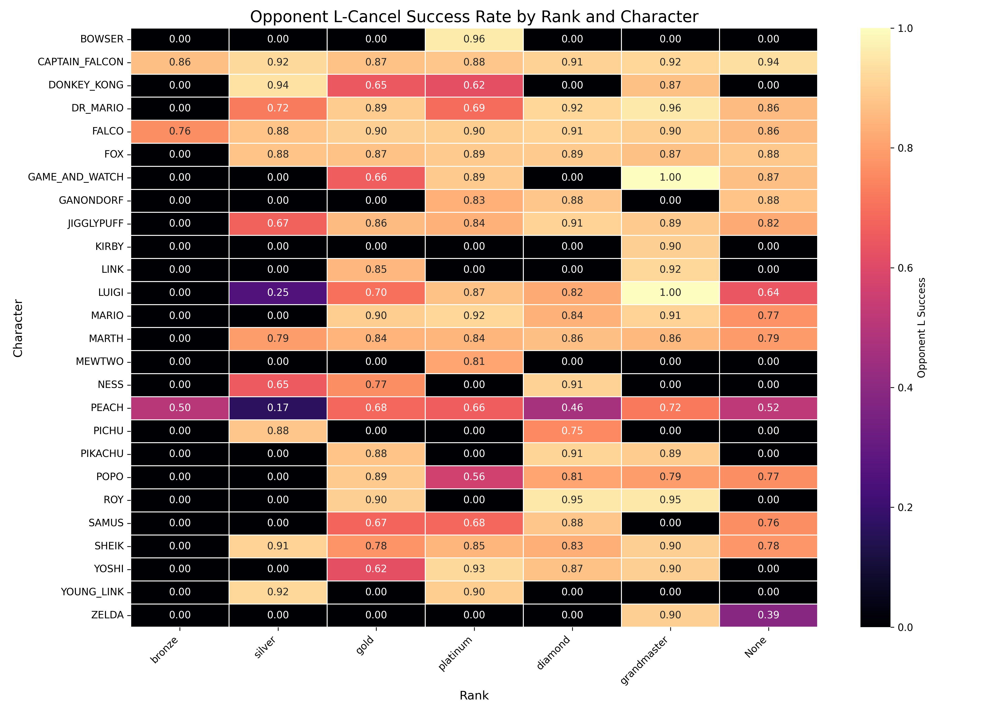

# Slippi Replay Analyzer

A Python tool for analyzing Super Smash Bros. Melee game data. This tool generates statistics, visualizes key metrics, and creates network-based graph visualizations. Originally designed for the 100 Wins Challenge, it can be adapted for other replay datasets.

---

## Features

- **Data Analysis**:
  - Processes Slippi replays to generate detailed game statistics.
  - Summarizes win/loss data, stage preferences, and character usage.

- **Chart and Graph Visualizations**:
  - Generates bar charts and plots for detailed analysis.
  - Creates network tables for advanced relationship analysis.

- **Customizable**:
  - Easy to adapt to different datasets or metrics.

---

## Example Network: Moky's 100 Wins Challenge

The following network graph showcases the relationship between player damage ratio (damage given/taken) and ranks across Moky's games:


*Graph created using Gephi.* *Larger version available in 'output/Moky100WinsExample'*

---

## General Stats

``` 
    -------------------------
    Games Overview:
      - Total Games: 1361
      - Average Game Length: 2:17 minutes
      - Longest Game: 5:51 minutes vs Ice Climbers on Dream Land N64
      - Shortest Game: 0:07 seconds vs Marth on Fountain Of Dreams

    Performance Highlights:
      - Total 4-Stocks: 141
      - Wins: 1313
      - Losses: 48
      - Win Rate: 96.47%
      
    Additional Metrics:
      - Average Stocks Taken per Game: 3.89
      - Average Stocks Lost per Game: 1.56
      - Total Damage Given: 571769.93
      - Total Damage Taken: 290364.20
      - Longest Win Streak: 102 games
      - Average Target L-Cancel Rate: 0.91%
      - Average Opponent L-Cancel Rate: 0.85% 
    -------------------------
```

### Character Distribution
Shows the frequency of each character used across all games:


### Stage Frequency
Stage frequency across all games:


### Ranked Frequency
Displays the frequency of ranks at each sub-rank:


---

## Challenge Stats

### Losses By Day
Tracks stage losses across each day of the challenge:


### Win Rate by Day
Visualizes the daily win rate throughout the challenge:


### Attempts
A simple plot of total attempts:


### Losses By Character & Day
Breaks down losses by character and day:


### Character and Rank Heatmap
Visualizes the rank distribution across all characters, highlighting patterns in character performance by rank:


### Opponent L Cancel Success Heatmap
Highlights opponent L-cancel success rates by rank and character, revealing trends in execution skill across ranks:

---

## Setup

### Requirements

- **Python**: Version 3.6+
- **Dependencies**:
  - `matplotlib`
  - `seaborn`
  - `Pillow`
  - `pandas`
  - `py-slippi==1.6.2`

Install the required libraries:
```bash
pip install matplotlib seaborn pillow pandas py-slippi==1.6.2
```

## Usage
To analyze Slippi replays:
1. Place your `.slp` files in the `input/` folder.
2. Run the analysis script: `python slippi_analyzer.py`.
3. Output graphs and statistics will be saved in the `output/` folder.

## Acknowledgments

- **Special Thanks**:  
  Thanks to [Moky](https://x.com/moky_dokie) for providing the 100 Wins Slippi replays for this analysis.

- **Character and Rank Icons**:  
  This project uses icons from [Grantismo's CoSlippiLeaderboard](https://github.com/Grantismo/CoSlippiLeaderboard).

