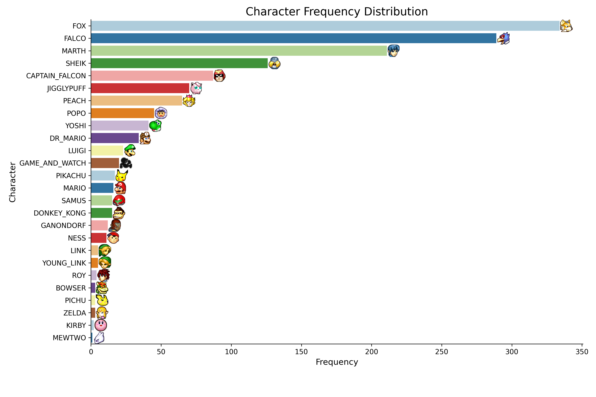
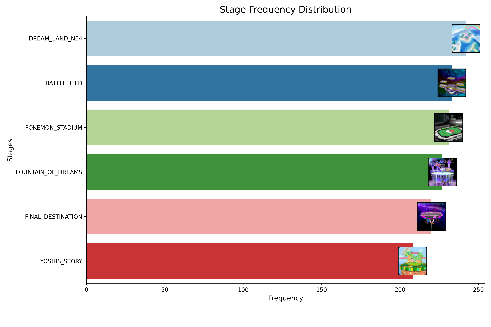
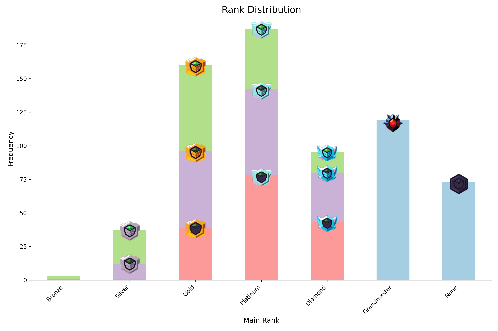
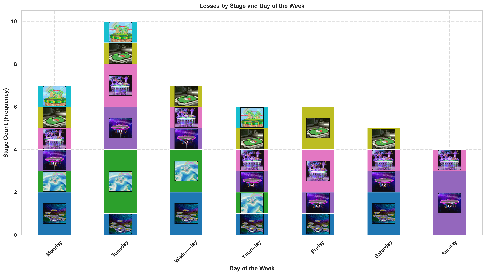
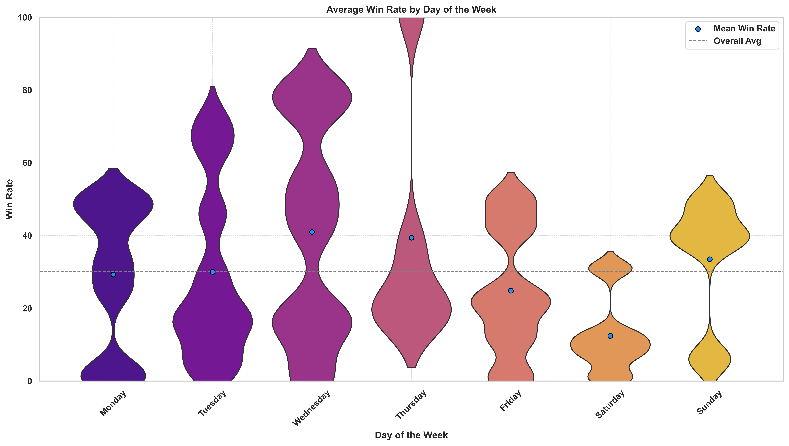
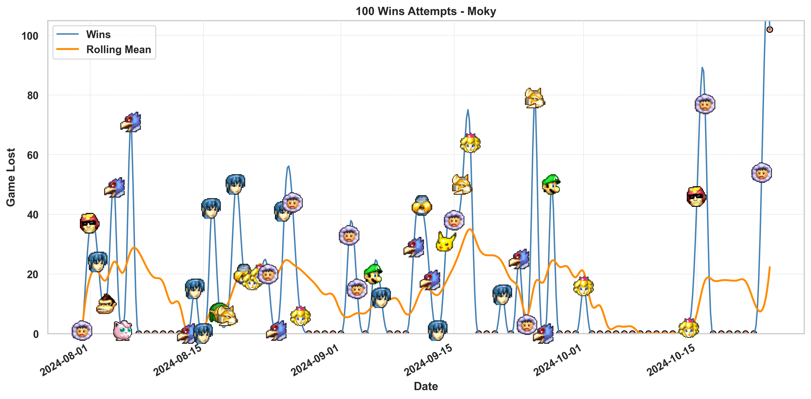
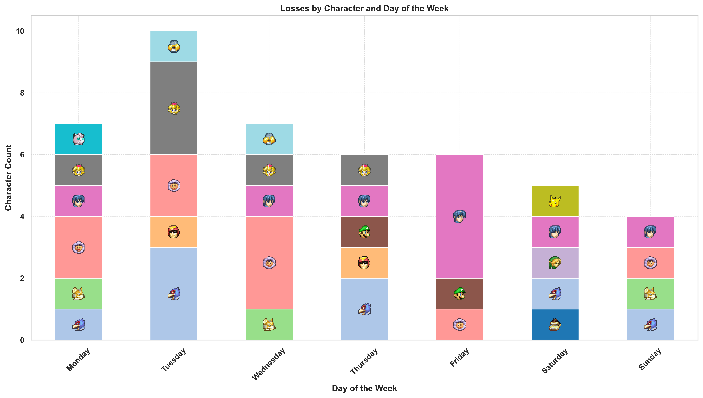
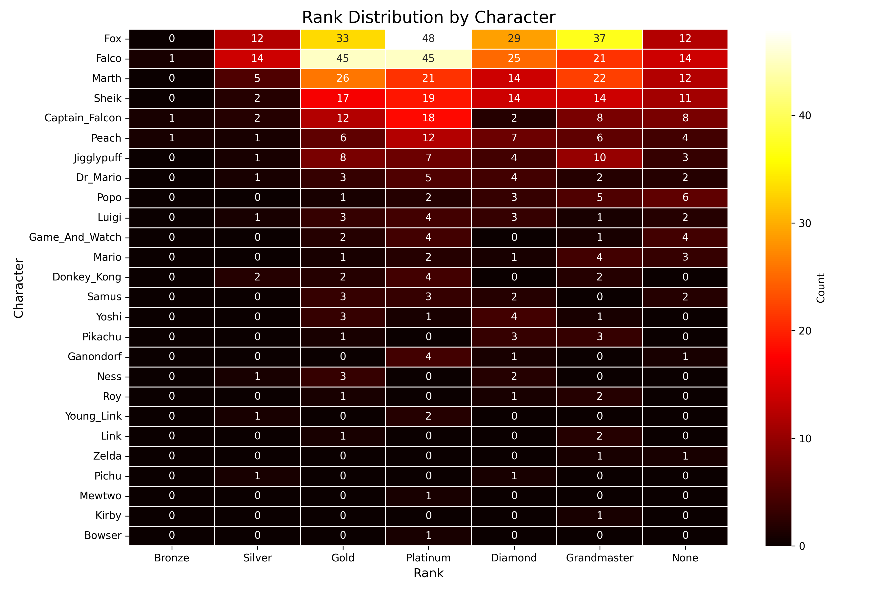

# Slippi Replay Analyzer

A Python tool for analyzing Super Smash Bros. Melee game data. This tool generates statistics, visualizes key metrics, and creates network-based graph visualizations. Originally designed for the 100 Wins Challenge, it can be adapted for other replay datasets.

---

## Features

- **Data Analysis**:
  - Processes Slippi replays to generate detailed game statistics.
  - Summarizes win/loss data, stage preferences, and character usage.

- **Chart and Graph Visualizations**:
  - Generates bar charts and plots for detailed analysis.
  - Creates network tables for advanced relationship analysis.

- **Customizable**:
  - Easy to adapt to different datasets or metrics.

---

## Example Network: Moky's 100 Wins Challenge

The following network graph showcases the relationship between player damage ratio (damage given/taken) and ranks across Moky's games:


*Graph created using Gephi.* *Larger version available in 'output/Moky100WinsExample'*

---

## General Stats

### Character Distribution
Shows the frequency of each character used across all games:


### Losses by Stage
Stage frequency across all games:


### Ranked Frequency
Displays the frequency of ranks at each sub-rank:


---

## Challenge Stats

### Losses By Day
Tracks stage losses across each day of the challenge:


### Win Rate by Day
Visualizes the daily win rate throughout the challenge:


### Attempts
A simple plot of total attempts:


### Losses By Character & Day
Breaks down losses by character and day:


### Character and Rank Heatmap
Visualizes the rank distribution across all characters, highlighting patterns in character performance by rank:



---

## Setup

### Requirements

- **Python**: Version 3.6+
- **Dependencies**:
  - `matplotlib`
  - `seaborn`
  - `Pillow`
  - `pandas`
  - `py-slippi==1.6.2`

Install the required libraries:
```bash
pip install matplotlib seaborn pillow pandas py-slippi==1.6.2
```

## Usage
To analyze Slippi replays:
1. Place your `.slp` files in the `input/` folder.
2. Run the analysis script: `python slippi_analyzer.py`.
3. Output graphs and statistics will be saved in the `output/` folder.

## Acknowledgments

- **Special Thanks**:  
  Thanks to [Moky](https://x.com/moky_dokie) for providing the 100 Wins Slippi replays for this analysis.

- **Character and Rank Icons**:  
  This project uses icons from [Grantismo's CoSlippiLeaderboard](https://github.com/Grantismo/CoSlippiLeaderboard).

